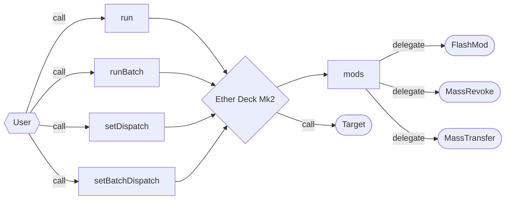
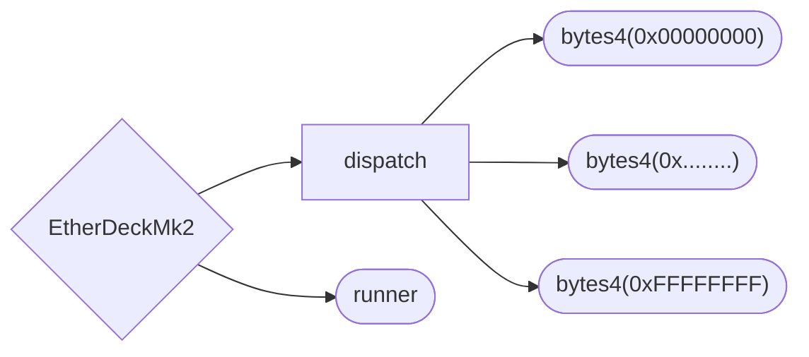

# Ether Deck Mk2

A reasonably optimized, extensible smart account.



## Core

### Storage

```solidity
// -- snip --
    mapping(bytes4 => address) public dispatch;
    address public runner;
// -- snip --
```



The core deck storage layout occupies two storage slots in accordance with solidity's
storage layout rules.

#### `dispatch`

Slot zero is occupied by a `dispatch` mapping which maps four byte selectors to mod addresses that
are authorized to mutate the deck. all dispatchers must be enabled by the deck's
[`runner`](#runner).

#### `runner`

Slot one is occupied by a `runner` address, the account authorized to run actions on the deck.

### ABI

#### `run`

```solidity
function run(address target, bytes calldata payload) external payable;
```

The `run` function makes an external call from the deck with a designated target, payload, and
value.

Reverts if the caller is not the [`runner`](#runner) or if the call fails.

#### `runBatch`

```solidity
function runBatch(
    address[] calldata targets,
    uint256[] calldata values,
    bytes[] calldata payloads
) external payable;
```

The `runBatch` function batches external calls from the deck with designated targets, payloads, and
values.

Reverts if the caller is not the [`runner`](#runner), the number of targets, values, and payloads
are inequal, or if any one of the calls fails.

#### `setDispatch`

```solidity
function setDispatch(bytes4 selector, address target) external;
```

The `setDispatch` function sets a target mod in the [`dispatch`](#dispatch) mapping based on the
given selector.

Logs the [`DispatchSet`](#dispatchset) event.

Reverts if the caller is not the [`runner`](#runner).

#### `setDispatchBatch`

```solidity
function setDispatchBatch(bytes4[] calldata selectors, address[] calldata targets) external;
```

The `setDispatchBatch` function sets an array of target mods in the [`dispatch`](#dispatch) mapping
based on the provided selector array.

Logs the [`DispatchSet`](#dispatchset) event.

Reverts if the caller is not the [`runner`](#runner).

#### `fallback`

```solidity
fallback() external payable;
```

The `fallback` function loads the mod address from the [`dispatch`](#dispatch) mapping.

If a mod address is set for the selector, the deck delegate calls to the mod, forwarding all
calldata, then bubbling up the returndata to the caller, either reverting or returning, depending on
the status of the mod delegate call.

If no mod address is set for the given selector, the deck returns the selector.

> Returning the selector when no address is set for the given selector allows the deck to receive
> tokens whose standards force the receiver to respond to transfer callbacks with the callback
> selector. Since the deck can make arbitrary contract calls, all future tokens received by the deck
> may be handled without mods.

Reverts if a mod target is set for the selector and the target reverts.

### Events

#### `DispatchSet`

```solidity
event DispatchSet(bytes4 indexed selector, address indexed target);
```

The `DispatchSet` event is logged when [`setDispatch`](#setdispatch) is called.

## Mods

Mods are contracts that may be delegate called by the deck to extend its functionality. Any contract
may be set as a mod for the deck, though serious [security considerations](#security-considerations)
must be taken before setting mods to the deck.

### Existing Mods

- [`BribeMod`](src/mods/BribeMod.sol): A mod for bribing external parties to run transactions on the runner's behalf.
- [`CreatorMod`](src/mods/CreatorMod.sol): A mod for creating contracts.
- [`FlashMod`](src/mods/FlashMod.sol): A mod for issuing ERC-3156 flashloans to external parties.
- [`FlatlineMod`](src/mods/FlatlineMod.sol): A mod for using a deadman's switch.
- [`MassRevokeMod`](src/mods/MassRevokeMod.sol): A mod for revoking approvals and operators in batch.
- [`MassTransferMod`](src/mods/MassTransferMod.sol): A mod for transferring in batch.
- [`Mod4337`](src/mods/Mod4337.sol): A mod for ERC-4337 compliance.
- [`StorageMod`](src/mods/StorageMod.sol): A mod for reading and writing storage slots in batch.
- [`TwoStepTransitionMod`](src/mods/TwoStepTransitionMod.sol): A mod for two-step runner transitions.

## Mod Registry

The mod registry stores mods with name and address lookups.

### ABI

#### `authority`

```solidity
function authority() external view returns (address);
```

The `authority` function returns the address with authority to mutate the mod factory.

#### `searchByName`

```solidity
function searchByName(string calldata) external view returns (address);
```

The `searchByName` function returns the address of a given named mod.

#### `searchByAddress`

```solidity
function searchByAddress(address) external view returns (string memory);
```

The `searchByAddress` function returns the name of a given mod address.

#### `transferAuthority`

```solidity
function transferAuthority(address newAuthority) external;
```

The `transferAuthority` function sets the new authority.

Logs the [`AuthoritySet`](#authorityset) event.

Reverts if the caller is not the [`authority`](#authority).

#### `register`

```solidity
function register(address modAddress, string calldata modName) external;
```

The `register` function writes to [`searchByName`](#searchbyname) and
[`searchByAddress`](#searchbyaddress) for a given mod address and name.

Logs the [`ModRegistered`](#modregistered) event.

Reverts if the caller is not the [`authority`](#authority).

### Events

#### `AuthorityTransferred`

```solidity
event AuthorityTransferred(address indexed newAuthority);
```

The `AuthorityTransferred` event is logged when [`transferAuthority`](#transferauthority) is called.

#### `ModRegistered`

```solidity
event ModRegistered(address indexed addr, string name);
```

The `ModRegistered` event is logged on when [`register`](#register) is called.

## Security

Invariants:

- no slots collide except when `StorageMod.write` is used
- no slot may be written without the explicit consent of the `runner`
- no tokens may be taken from the deck at the end of the transaction without the explicit consent of the `runner`
- `runner` slot is overwritten only:
  - on `StorageMod.write` call with slot `0x01`
  - to the desginated `receiver` on `FlatlineMod.contingency` call after the `interval` has passed since `lastUpdate`
  - on `TwoStepTransition.acceptRunnerTransition` call by the `newRunner`

Assumptions:

- `runner` will not set a malicious mod
- `runner` is aware of all storage slots passed to `StorageMod.write`
- `runner` is aware of all storage slots and indices in each mod
- `runner` will not call `FlashMod.setFlashFeeFactor` with a malicious token

### Mods

Mods have full write access to the deck via `delegatecall`.

Per convention, mods that require their own storage must namespace storage using a keccak hash minus
one.

```solidity
uint256 storageSlot = uint256(keccak256("EtherDeckMk2.<storage_name>")) - 1;
```
