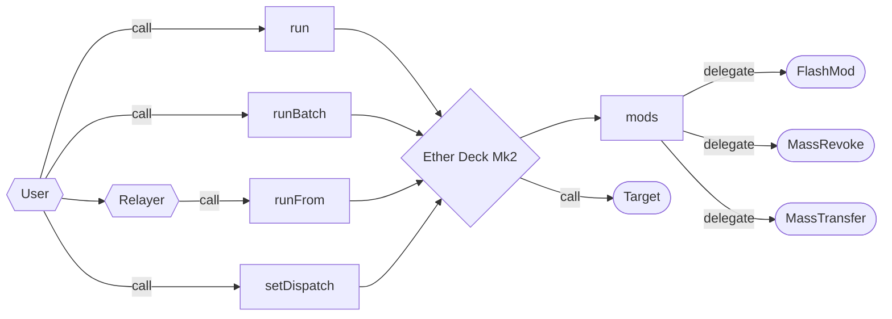

# Ether Deck Mk2

A reasonably optimized, extensible smart account.



## Core

### Storage

```solidity
// -- snip --
    mapping(bytes4 => address) public dispatch;
    address public runner;
    uint256 public nonce;
// -- snip --
```

The core deck storage layout occupies three storage slots in accordance with solidity's
storage layout rules.

#### `dispatch`

Slot zero is occupied by a `dispatch` mapping which maps four byte selectors to mod addresses that
are authorized to mutate the deck. all dispatchers must be enabled by the deck's
[`runner`](#runner).

#### `runner`

Slot one is occupied by a `runner` address, the account authorized to run actions on the deck.

#### `nonce`

Slot two is occupied by a `nonce` value, the nonce associated with [`runner`](#runner)'s delegated
calls count.

### ABI

#### `run`

```solidity
function run(address target, bytes calldata payload) external payable;
```

The `run` function makes an external call from the deck with a designated target, payload, and
value.

Reverts if the caller is not the [`runner`](#runner) or if the call fails.

#### `runBatch`

```solidity
function runBatch(
    address[] calldata targets,
    uint256[] calldata values,
    bytes[] calldata payloads
) external payable;
```

The `runBatch` function batches external calls from the deck with designated targets, payloads, and
values.

Reverts if the caller is not the [`runner`](#runner), the number of targets, values, and payloads
are inequal, or if any one of the calls fails.

#### `runFrom`

```solidity
function runFrom(
    address target,
    bytes calldata payload,
    bytes calldata sigdata,
    uint256 bribe
) external payable
```

The `runFrom` function makes an external call form the deck with a designated target, payload, and
value and pays the caller a designated bribe to run the transaction on behalf of the `runner`.

Reverts if the elliptic curve public key recovery fails, the signer is not the runner, the signed
hash does not match the payload, target, call value, bribe, and [`nonce`](#nonce), the bribe fails,
or the call fails.

#### `setDispatch`

```solidity
function setDispatch(bytes4 selector, address target) external;
```

The `setDispatch` function sets a target mod in the [`dispatch`](#dispatch) mapping based on the
given selector.

Logs the [`DispatchSet`](#dispatchset) event.

Reverts if the caller is not the [`runner`](#runner)

#### `fallback`

```solidity
fallback() external payable;
```

The `fallback` function loads the mod address from the [`dispatch`](#dispatch) mapping.

If a mod address is set for the selector, the deck delegate calls to the mod, forwarding all
calldata, then bubbling up the returndata to the caller, either reverting or returning, depending on
the status of the mod delegate call.

If no mod address is set for the given selector, the deck returns the selector.

> Returning the selector when no address is set for the given selector allows the deck to receive
> tokens whose standards force the receiver to respond to transfer callbacks with the callback
> selector. Since the deck can make arbitrary contract calls, all future tokens received by the deck
> may be handled without mods.

Reverts if a mod target is set for the selector and the target reverts.

### Events

#### `DispatchSet`

```solidity
event DispatchSet(bytes4 indexed selector, address indexed target);
```

The `DispatchSet` event is logged when [`setDispatch`](#setdispatch) is called.

## Mods

Mods are contracts that may be delegate called by the deck to extend its functionality. Any contract
may be set as a mod for the deck, though serious [security considerations](#security-considerations)
must be taken before setting mods to the deck.

### Creator Mod

> todo

### Flash Mod

> todo

### Mass Revoke Mod

> todo

### Mass Transfer Mod

> todo

### Mod 4337

> todo

### Storage Mod

> todo

### Two Step Transition Mod

> todo

## Security Considerations

> todo
